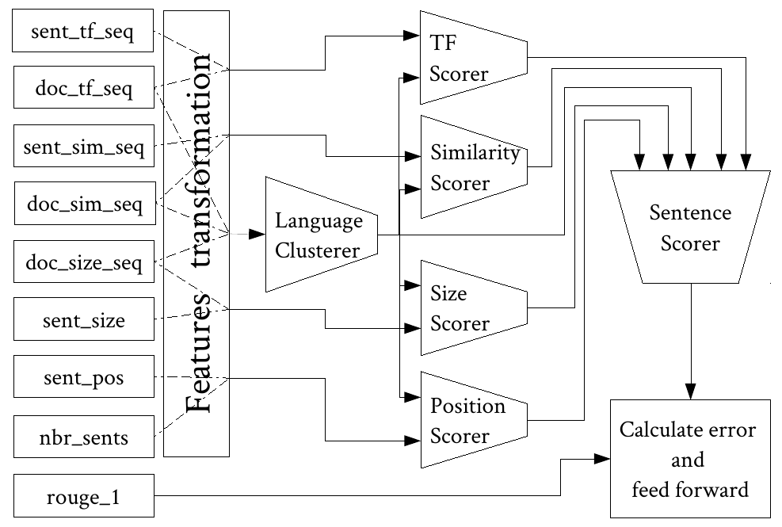

# (ML)<sub>2</sub> ExtraSum

[](https://github.com/kariminf/ML2ExtraSum)
[](https://github.com/kariminf/ML2ExtraSum)
[](http://www.apache.org/licenses/LICENSE-2.0)


(ML)<sub>2</sub> ExtraSum: Machine Learning based Multi-Lingual Extractive Summarizer

It is a system which uses some surface features extracted from the sentences and their documents to learn ROUGE-1 score of each sentence.
Our idea is to express the problem of text summarization as a problem of regression.
Using some features of a sentence and its document, the system must learn to estimate ROUGE-1 of this sentence based on a reference summary.



As shown in the previous figure, we build some blocks of multi-layer neural networks which we call scorers.
Each scorer receives one type of features; for instance, there is a scorer which scores a sentence based on its term frequencies and those of its document.
All these scorers outputs are fed into another scorer to be combined into one final score which is meant to be an estimation of ROUGE-1 score of the sentence in question.
The system is trained on multiple languages, this is why a block (language clusterer) is reserved to detect the language.
In our case, the language clusterer represent each language as a two dimentional vector which is fed into other scorers so they learn to score based on the language.


## How to use

Go to [Release-1.0.0](https://github.com/kariminf/ML2ExtraSum/releases/tag/1.0.0)
and download the stats files (training and testing).

You have to configure config.json. It contains the thse options:

* TRAIN_DIR: the directory where the training statistics are
* TEST_DIR: the directory where the testing statistics are
* MOD_DIR: the directory where the model will be saved after training
* MOD_NAME: the model's name

* SIZE_DIR: the directory where the summaries sizes are (MultiLing2015)
* SUM_DIR: the directory where the testing summaries will be generated
* REF_DIR: the directory where the testing reference summaries are (MultiLing2015)

* TRAIN_ITER: number of iterations (epochs)
* LEARNING_RATE: learning rate
* StatNet: type of model, it can be "basic", "filter", "norm" or "pure"
* PLOT: a list of languages codes, which we want to plot their lang scores. It must be equal or less than 15.
* EXT: the extension we want to add to XML eval files


To train the model, execute the following code.
It will read the statistics from TRAIN_DIR and create a model named MOD_NAME in the folder MOD_DIR.
```
python model_trainer.py
```

After training, comes the step of testing. The estimator launches the model MOD_NAME from the folder MOD_DIR. It is fed by the statsitics in TEST_DIR. Then, a file "scores.json" is created in SUM_DIR.
```
python scores estimator.py
```
The file "scores.json" will contain scores of each sentence in each document of each language. It contains intermediary scores as well. Here an example of this file:
```
{	"en": {
		"0fb33cd018ad2920a6c4fcfaba506f06":{
			"cost": 0.0039053406,
			"lang": [0.5183228254318237, 0.5272114276885986],
			"tf": [0.5001200437545776, 0.49997472763061523, 0.5001181960105896, 0.5001194477081299],
			"sim": [0.49604153633117676, 0.49604153633117676, 0.49604153633117676, 0.49604153633117676],
			"pos": [3.0391814065389156e-10, 2.8634777882174944e-10, 1.9580145838027363e-10, 1.32543149788944e-08],
			"size": [0.5179056525230408, 0.527980387210846, 0.5195688605308533, 0.5211496949195862]
		}
},
```

To generate summaries based on the estimated scores "scores.json", you will need to execute the following command.
The program will generate summaries for each language in the folder SUM_DIR.
It must have the sizes of summaries afforded in folder SIZE_DIR.
```
python summary_extractor.py
```

To plot the clustrer's values for the languages you specified in PLOT, you must execute the following command.
```
python lang_plotter.py
```

To use ROUGE, you have to generate some XML files which indicates where to find the generated summaries (SUM_DIR) and where to find the reference summaries (REF_DIR). Different XML files will be generated in the folder SUM_DIR with an extension EXT.xml.
```
python eval_preparator.py
```

Then, go to [LangPi](https://github.com/kariminf/langpi)

execute the program kariminf.langpi.eval.ats.XKRouge after editing the locations.

The same program is in **helpers/data_eval/** can be opened using eclipse and grandle. But, it may not work.

The program will generate csv files for each language.
To fuse them together, use the script **helpers/eval_fuse/_fuse3.py"**.


## License
Copyright (C) 2018-2019 Abdelkrime Aries

Licensed under the Apache License, Version 2.0 (the "License");
you may not use this file except in compliance with the License.
You may obtain a copy of the License at

[http://www.apache.org/licenses/LICENSE-2.0](http://www.apache.org/licenses/LICENSE-2.0)

Unless required by applicable law or agreed to in writing, software
distributed under the License is distributed on an "AS IS" BASIS,
WITHOUT WARRANTIES OR CONDITIONS OF ANY KIND, either express or implied.
See the License for the specific language governing permissions and
limitations under the License.
